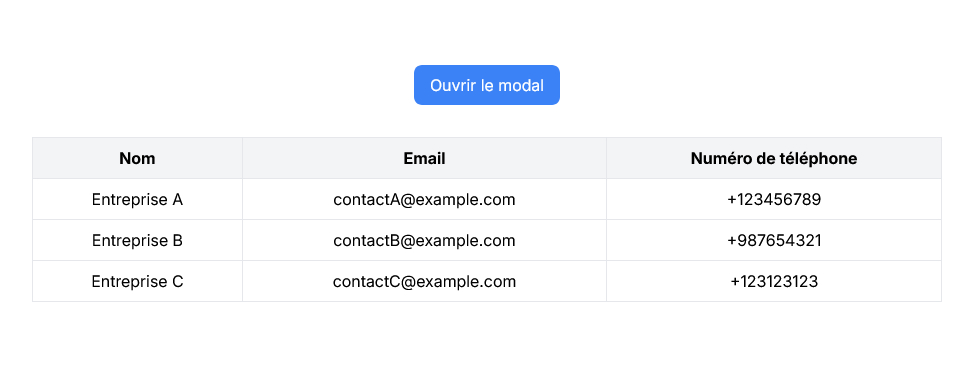

## Extration de données avec S3
### Systèmes de recupération des informations des fichiers excels et json avec remix js et serveur S3 avec aws-sdk
##
- git clone récupération du projet
##
    git clone [Lien du repo]
##
### `Configuration de remix`
- Installation des dépendances
##
    npm install
##
- Lancer le projet
##
    npm run dev
##
### `Configuration du serveur`
### Configuration du serveur en node js
- Si vous avez choisi d'utilser node js pour la configuration comme serveur de donnée
- Installation des dépendances
##
    npm install
##
- Lancer le projet
##
    npm run dev
##
### Configuration du serveur avec docker
- Si vous avez choisi d'utilser docker pour la configuration du serveur  comme serveur de donnée
- Téléchager les packages
##
    docker-compose build
##
- Lancer le container
##
    docker-compose up -d
##

  

